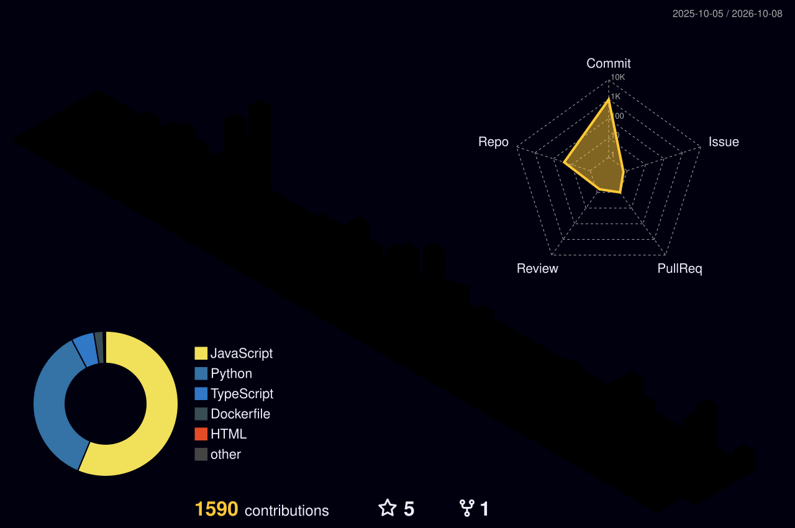

 

 

&nbsp;

 

---

## About

I'm a software engineer who gets genuinely excited about building things, full-stack web applications, AI systems, and everything in between. I've spent a lot of time figuring out how to make large language models and agent frameworks actually useful in production, not just in demos.

Most of my work lives at the intersection of **modern web development** and **AI orchestration**. I like systems that are fast, thoughtful, and built to last.

Right now I'm focused on:

- Building multi-agent workflows that solve real problems, not toy examples
- Shipping full-stack applications with Next.js, TypeScript, and FastAPI
- Exploring how vector databases and RAG can make AI genuinely useful
- Writing better code than I did last month

If something I've built is useful to you, or you want to talk shop — I'm always down.

 

---

## What I Work With

<table>
<tr>
<td align="center" width="33%">

**Languages**

`Python` &nbsp; `TypeScript` &nbsp; `JavaScript`

</td>
<td align="center" width="33%">

**AI & Agents**

`LangChain` &nbsp; `LangGraph` &nbsp; `OpenAI` &nbsp; `PyTorch`

</td>
<td align="center" width="33%">

**Web & APIs**

`Next.js` &nbsp; `React` &nbsp; `Node.js` &nbsp; `FastAPI`

</td>
</tr>
<tr>
<td align="center" width="33%">

**Databases**

`PostgreSQL` &nbsp; `MongoDB` &nbsp; `Redis` &nbsp; `Supabase`

</td>
<td align="center" width="33%">

**Styling**

`Tailwind CSS` &nbsp; `CSS` &nbsp; `HTML`

</td>
<td align="center" width="33%">

**DevOps & Cloud**

`Docker` &nbsp; `Kubernetes` &nbsp; `AWS` &nbsp; `CI/CD`

</td>
</tr>
</table>

 

---

## Activity & Stats

 

---

<picture>
  
</picture>

 

---

## Contribution Grid

<picture>
  
</picture>

  

<picture>
  <source media="(prefers-color-scheme: dark)" srcset="https://raw.githubusercontent.com/Knowledge-Benjamin/Knowledge-Benjamin/output/github-contribution-grid-snake-dark.svg">
  <source media="(prefers-color-scheme: light)" srcset="https://raw.githubusercontent.com/Knowledge-Benjamin/Knowledge-Benjamin/output/github-contribution-grid-snake.svg">
  
</picture>

  

<picture>
  
</picture>

 

---

## Let's Connect

If you've read this far, let's talk.

 

&nbsp;

  

 

